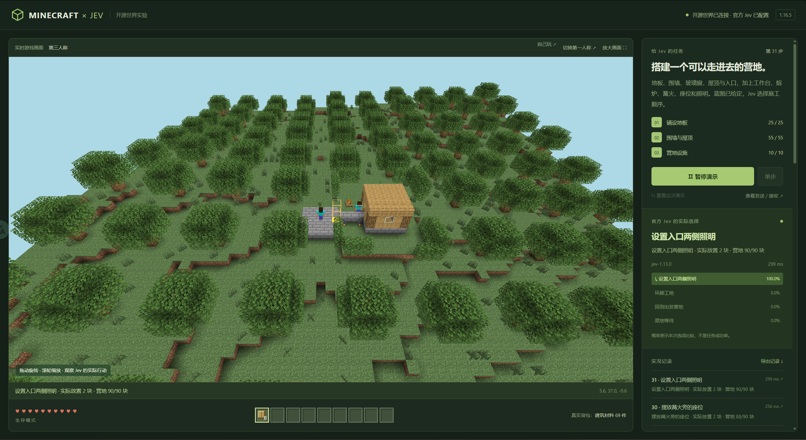
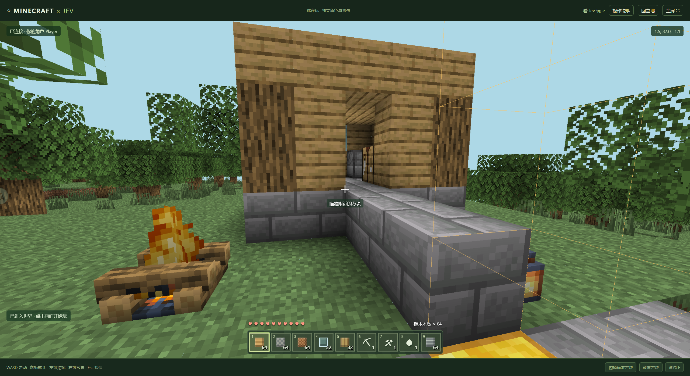

# jev-minecraft

**让 Jev 在开源 Minecraft 兼容世界里决定下一步：采集、建造，搭起一个可以走进去的营地。你也能直接进入同一个世界玩。**





## 项目简介

这是一个展示 **Jev 决策模型**的可运行 demo。每一步，程序把机器人的位置、背包、附近方块、任务进度和当前可执行选项发给 TypeSafe 官方 Jev。Jev 选择下一项，Mineflayer 控制机器人实际走路、挖掘、拾取和放置，最后读取真实世界检查结果。

你可以看着它完成任务，也可以打开独立玩家页面，进入同一个世界走动、挖掘和建造。模型的真实请求、返回结果、选项概率和游戏执行结果都能查看、导出。

### 两种任务

| 任务 | 内容 | 完成条件 |
| --- | --- | --- |
| 采集与木柱 | 空手收集 4 块原木，在金色地基上搭 3 格高木柱，回到营地 | 采集记录、连续木柱和机器人位置同时满足要求 |
| 完整营地 | 5×5 地板、围墙、3 扇玻璃窗、屋顶、入口、工作台、熔炉、步道、篝火、座位与照明 | 90 个实际方块全部到位、入口畅通，并回到出发营地 |

**营地蓝图和材料由程序给定，Jev 选择施工顺序。** 每次施工选项对应 1—5 块方块；地板、围墙、屋顶有先后和支撑约束。寻路与逐块放置由执行器完成，材料真实扣减。模型失败或动作失败会暂停，不会用后台直接放置建筑来代替模型。

已有一次完整营地实测：官方返回模型 `jev-1.13.0`，32 次决策完成 90 块施工。记录见 [camp-verified-run.json](evidence/camp-verified-run.json)。这是该场景的一次演示结果。

<details>
<summary>jev商业定制、技术场景交流欢迎联系，请注明来意</summary>

<br>


</details>

## 本地部署

### 环境要求

- Node.js **22 或更高版本**（Mineflayer 的版本要求）。
- pnpm **10**，本项目使用 `10.32.1`，提交了锁文件。
- 能访问 TypeSafe 官方 API 的网络；让 Jev 决策需要自己的官方 API 密钥。
- 游戏通过浏览器打开，不需要安装 Minecraft 官方客户端或登录微软账户。

### 下载和启动

```bash
git clone https://github.com/BHD110/jev-minecraft.git
cd jev-minecraft
npm install -g pnpm@10.32.1
pnpm install --frozen-lockfile
pnpm start
```

浏览器打开 **[http://127.0.0.1:5192/](http://127.0.0.1:5192/)**。第一次加载地形可能需要数秒。保持启动服务的终端运行；停止服务会断开世界。

Windows 安装依赖后，也可以双击 [start.cmd](start.cmd) 启动。

### 输入 Jev 密钥

**不需要修改源代码。** 没检测到密钥时，页面会显示输入窗口。填写从 [TypeSafe 官方平台](https://typesafe.ai) 获取的密钥，点击“输入并启用”，就能开始演示，无需重启。

- 页面输入的密钥仅存在当前服务进程的内存中；不写入 `.env`、游戏记录、浏览器本地存储或 Cookie。
- 关闭输入窗口会清空输入框。服务重启后，需要重新输入。
- 页面上的“更换密钥”可替换当前配置，需要等演示暂停、当前操作结束。
- 输入时检查格式，密钥是否有效由第一次真实模型请求验证。调用失败会显示错误并暂停，可更换密钥后继续。
- 不输入密钥也能查看世界和使用“自己玩”。

如果希望自己的机器重启后自动读取密钥，可以选择在环境变量中设置 `TYPESAFE_API_KEY`，或复制 `.env.example` 为 `.env` 后填写：

```dotenv
# 填入你自己的密钥；不要提交这个文件。
TYPESAFE_API_KEY=
JEV_MC_PORT=5192
JEV_MC_GAME_PORT=25566
```

环境变量优先于项目 `.env`；`.env` 已被 Git 忽略。仓库只提供留空的 `.env.example`，不包含可用密钥。模型接口固定为 `https://api.typesafe.ai`，使用 `jev-latest` 别名，记录中保存实际返回的模型版本。

### Linux 服务器部署

同样安装 Node.js 22+ 和 pnpm 10，下载项目、安装依赖并运行 `pnpm start`。默认两个服务都绑定 `127.0.0.1`，可通过 SSH 转发访问：

```bash
# 在自己的电脑执行，把 user 和 server 换成你的服务器登录信息。
ssh -N -L 5192:127.0.0.1:5192 user@server
```

保持 SSH 连接，在自己电脑的浏览器打开 `http://127.0.0.1:5192/`。浏览器画面与控制接口共用这个端口，无需开放游戏协议端口。

这是单世界、单共享 Jev 配置的 demo，没有多人账号隔离；默认部署方式为本机使用或 SSH 转发。

### 依赖安装与常见问题

- **端口被占用**：在环境变量或 `.env` 中修改 `JEV_MC_PORT`（页面，默认 `5192`）和 `JEV_MC_GAME_PORT`（游戏协议，默认 `25566`），然后重启。
- **画面还没有地形**：等待资源加载；切换视角也会重新加载部分画面。
- **`canvas` 安装失败**：它使用原生依赖。常见 Windows x64、macOS、Linux x64 glibc 平台有预编译包；若平台需要从源码编译，按 [node-canvas 官方说明](https://github.com/Automattic/node-canvas#compiling) 安装 Cairo、Pango 等依赖。Ubuntu 常用命令如下：

```bash
sudo apt-get install build-essential libcairo2-dev libpango1.0-dev libjpeg-dev libgif-dev librsvg2-dev
pnpm install --frozen-lockfile
pnpm rebuild canvas
```

锁定依赖和 `canvas` 构建白名单已写在项目配置中，不需要手动修改源代码。

## 怎么演示

1. 打开首页，配置密钥。
2. 默认是采集与木柱任务；要演示完整营地，点击“升级为完整营地”。
3. 点击“让 Jev 开始”，自动连续决策；“单步”只执行一次。
4. 切换第三人称看建造全貌，可拖动旋转、滚轮缩放；第一人称看机器人实时视线。
5. 点击“查看发送 / 接收”检查每一步，或“导出记录”下载本局 JSON。
6. 营地完成后，点击“自己玩”，沿步道走进小屋。

“暂停演示”会在当前操作结束后停下。“重置这次演示”会准备当前任务的初始状态；完整营地模式会清理施工区域并重新补充材料。每次重启服务都会生成新世界，当前不提供世界存档恢复。

### 自己玩

打开 **[http://127.0.0.1:5192/play.html](http://127.0.0.1:5192/play.html)**。你的 `Player` 角色与 Jev 共享方块世界，背包各自独立；单次只有一个页面能控制玩家角色。

| 操作 | 按键 |
| --- | --- |
| 移动 / 跳跃 | WASD / 空格 |
| 疾跑 / 潜行 | Ctrl / Shift |
| 选快捷栏 / 看背包 | 1—9 或滚轮 / E |
| 挖掘 / 放置 | 左键 / 右键；页面也有操作按钮 |
| 转头 | 鼠标；不支持鼠标锁定时，按住画面拖动或使用方向键 |
| 暂停操作 | Esc；失去焦点也会停止移动 |

开局发放基础材料与工具，放置消耗背包物品，走近掉落物可以拾取。“回营地”只移动你的角色。玩家改变方块可能影响 Jev 任务，自己的建筑建议放在工地旁边。

## 实现与范围

```text
游戏真实状态 → 当前可执行选项 → 官方 Jev 选择
                                      ↓
下一次游戏状态 ← 服务端方块与背包检查 ← Mineflayer 执行
```

- [Flying Squid](https://github.com/PrismarineJS/flying-squid)：开源 Minecraft 兼容服务端、地形与方块交互。
- [Mineflayer](https://github.com/PrismarineJS/mineflayer) 与 [Pathfinder](https://github.com/PrismarineJS/mineflayer-pathfinder)：实际游戏协议操作与地形寻路。自动挖路、自动搭路关闭。
- [Prismarine Viewer](https://github.com/PrismarineJS/prismarine-viewer)：浏览器区块画面与实时视角。
- [TypeSafe SDK](https://docs.typesafe.ai/sdk/javascript)：调用官方 Jev 决策 API。

协议版本固定为 `1.16.5`，机器人连接本机离线模式的开源服务端。Jev 读取结构化数据，不直接看截图，也不操作浏览器鼠标键盘。

本项目是 Minecraft **兼容世界**的演示，不是 Mojang 官方客户端或完整游戏。支持采集、拾取、直接建造和查看背包；工作台、熔炉等目前作为场景设施放置，未实现完整合成、熔炼、物品拖拽或多人账号系统。

采集任务最多 30 次决策，完整营地最多 80 次。记录包含请求、返回、实际模型、耗时、选中动作和执行前后状态，写入本机 `logs/run-<id>.json`；该目录不会提交到 Git。

## 测试与代码

```bash
pnpm test
```

测试覆盖实际通关条件、合法施工阶段、入口畅通、玩家输入约束，以及无密钥启动、运行时配置密钥和跨站请求限制。历史真实演示记录保存在 [evidence/](evidence/)。

| 文件 | 用途 |
| --- | --- |
| `server.mjs` | 服务启动、任务控制、调用 Jev 与记录结果 |
| `jev-credentials.mjs` | 运行时密钥配置与本机配置接口 |
| `game.mjs` / `camp-game.mjs` | 游戏状态、任务选项、执行与验收 |
| `human-player.mjs` | 玩家角色、移动、挖掘、放置 |
| `viewer-server.mjs` / `worldgen.cjs` | 实时画面与森林地形 |
| `public/` | 中文演示与玩家界面 |

## 许可证

新增接入代码使用 [MIT](LICENSE)。上游依赖保留各自许可证；Minecraft 名称、纹理及其他原始资产的权利归相应权利人。本项目与 Mojang、Microsoft 无官方关联。
